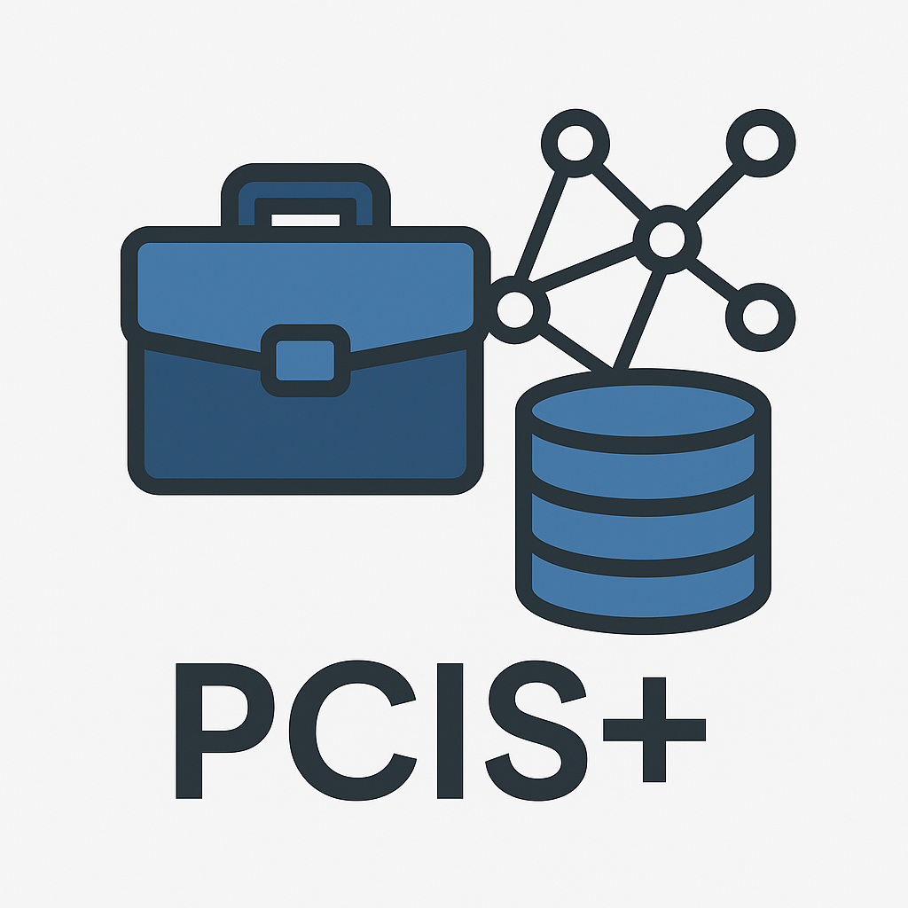

# EC Classification Relativity Search Assistant

## 🔍 Overview

The **EC Classification Relativity Search Assistant** is a custom semantic tool designed to help classification advisors and HR professionals explore comparator work descriptions based on classification similarity. It uses OpenAI embeddings to simulate alignment with EC classification elements, hosted in the Government of Canada's **PCIS+** system.

## 🧭 Features

- 📎 **Upload Work Descriptions** and compare against known EC positions
- 🔍 **Search by Theme** (planned)
- 📊 **Browse by EC Level** (planned)
- 📘 **Relativity Explainer** for transparency and guidance

## 🛠️ Powered By

- [Streamlit](https://streamlit.io/)
- [OpenAI API](https://platform.openai.com/)
- Semantic similarity using `text-embedding-3-small`

## 🔐 Setup (Streamlit Cloud)

1. Add your `OPENAI_API_KEY` in **Streamlit Cloud > Settings > Secrets**
2. Upload:
   - `streamlit_app.py`
   - `requirements.txt`
   - `README.md`
3. Deploy from GitHub

---

For internal demo use only – not connected to live GC systems.
